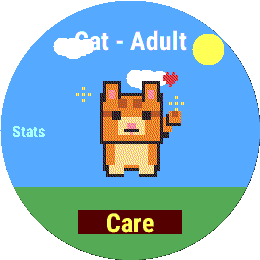
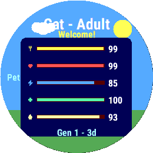
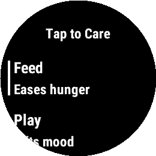
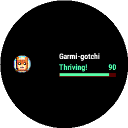

<h1 align="center">🐾 Garmigotchi</h1>

<p align="center">
  <b>A Tamagotchi-style virtual pet that lives on your Garmin watch.</b><br>
  Raise it, feed it, play with it, and keep it happy — powered by your real-world activity.
</p>

<p align="center">
  
</p>

<p align="center">
  
  
  
  
</p>

---

## 📸 Screens

<table>
  <tr>
    <td align="center"><br><b>Pet</b><br><sub>Your pet, centered in a day/night world</sub></td>
    <td align="center"><br><b>Stats</b><br><sub>Five labeled needs, generation &amp; age</sub></td>
  </tr>
  <tr>
    <td align="center"><br><b>Care menu</b><br><sub>Feed, Play, Clean, Sleep, Medicine…</sub></td>
    <td align="center"><br><b>Glance</b><br><sub>At-a-glance status in the widget carousel</sub></td>
  </tr>
</table>

---

## ✨ Features

### 🐣 Your pet
- **Five species** — Cat, Dog, Dragon, Penguin, and Fox, each with its own sprites.
- **Grows up** through four life stages: **Egg → Baby → Teen → Adult**.
- **Expressive moods** — idle, happy, sad, sleepy, and sick poses (plus a ghost if neglected too long).
- **Breathes and bobs** when idle so it always feels alive.

### 🍽️ Care loop
- **Five needs** to balance, each with its own icon: 🍴 Hunger · ❤️ Happiness · ⚡ Energy · ✚ Health · 💧 Cleanliness.
- **Feed** — and each animal eats its **own food** (the cat gets a fish, the dog a bone, the dragon a drumstick, the fox berries…), nibbled away **one bite at a time**.
- **Play** — a quick **catch-the-ball mini-game**; the better your score, the happier your pet.
- **Clean** — poop piles up over time and drags down cleanliness until you hose it off. 🚿
- **Sleep** — tuck it in for a multi-hour nap (it also **dozes off on its own at night**).
- **Medicine** — cure your pet when it gets sick.

### 🎬 Juicy animations
Every care action plays a little hand-drawn flourish — a burger/fish eaten bite by bite, a shower of water droplets, a bouncing ball, drifting **Zzz**'s, and a wobbling medicine pill.

### 🌍 A living world
- A **day/night sky** with a sun and clouds by day, a crescent moon and stars by night.
- The pet **sleeps when you sleep** and wakes with the morning.

### 🧬 Aging, evolution & legacy
- How well you raise your pet decides the **adult form** it grows into — a radiant ⭐ star or a grumpy ☁️ cloud.
- When a pet passes on, you start the **next generation**: a fresh egg that **inherits a trait** (Hardy, Cheerful, Tidy, or Energetic) which eases one stat's decay forever after.
- The stats page tracks your **generation** and your pet's **age**.

### ⌚ Built for Garmin
- **Your real activity feeds the pet** — steps and heart rate nudge its stats, so wearing and moving keeps it thriving.
- **Glance** support for a quick status check in the widget carousel.
- A published **watch-face complication** so your pet's wellbeing can show on your watch face.
- **Timestamp-driven** simulation: stats advance correctly whether the app is open or you check back a day later — including time spent asleep.
- Everything **persists** across launches.

---

## 🎮 Controls

| Input | Pet page | Stats page |
|---|---|---|
| **START** / tap the **Care** button | Open the Care menu (or Hatch / Wake / Legacy) | — |
| **Tap** elsewhere on screen | Go to the **Stats** page | Back to the **Pet** page |
| **Up / Down** (or swipe) | Flip between Pet ↔ Stats | Flip between Pet ↔ Stats |
| **MENU** (long-press Up) | Open **Settings** | Open **Settings** |
| **BACK** | Exit | Exit |

> 💡 Care only opens from the **button** — tapping the pet takes you straight to the Stats page.

**Settings** (long-press MENU): toggle vibration, change pet, or reset the game.

---

## 🛠️ Building & Running

### Requirements
- [Garmin Connect IQ SDK](https://developer.garmin.com/connect-iq/sdk/) 4.2.0 or newer (developed against **9.1.0**)
- A Connect IQ **developer key** (`developer_key.der`)
- JDK 21 (bundled tooling expects it; adjust the path in `build.ps1` if yours differs)

### Build & run in the simulator (Windows / PowerShell)
```powershell
# Build for a device
./build.ps1 -Device fenix7

# Build and launch in the Connect IQ simulator
./build.ps1 -Device fenix7 -Run

# Package a signed .iq for the Connect IQ Store
./build.ps1 -Export
```

### Or with the raw compiler
```powershell
monkeyc -f monkey.jungle -o bin/Garmigotchi.prg -y developer_key.der -d fenix7
connectiq
monkeydo bin/Garmigotchi.prg fenix7
```

**Supported devices:** `fr255`, `fr265`, `fr955`, `fr965`, `venu2`, `venu3`, `fenix7`, `fenix7pro`, `epix2`.
> ⚠️ The watch-face complication needs **API 4.2.0+**; a couple of older targets may need it guarded or removed before a store release.

### 📷 Capturing screenshots
`tools/savescreenshot.ps1` grabs the simulator's display 1:1, masks it to the watch shape, and saves a numbered PNG into `assets/`. Run it with **Windows PowerShell 5.1** (not PowerShell 7):
```powershell
powershell.exe -NoProfile -ExecutionPolicy Bypass -File tools/savescreenshot.ps1
```

---

## 📁 Project Structure

```text
manifest.xml                  Connect IQ manifest (app id, permissions, products)
monkey.jungle                 Build configuration
build.ps1                     Build / run / export helper
source/
  TamagotchiApp.mc            App lifecycle + complication publishing
  TamagotchiView.mc           Main UI: pet page, stats page, animations, input
  TamagotchiGlanceView.mc     Glance (carousel) summary
  Pet.mc                      Stats, stages, moods, sleep, poop, aging, legacy
  CareMenu.mc                 The Care action menu
  PlayGame.mc                 Catch-the-ball mini-game
  SettingsMenu.mc             Settings menu (vibration / change pet / reset)
  PetComplication.mc          Publishes pet wellbeing as a complication
  StorageManager.mc           Persistence
resources/
  drawables/ images/          Pixel-art sprites & icons
  complications/              Complication definition
  strings/ layouts/           Strings and layouts
tools/
  generate_pixel_pet_pack.py  Generates the pixel-pet art packs
  copy_ciq_resources.py       Copies pack art into resources/images
  generate_garmin_app_icon.py App icon generator
  savescreenshot.ps1          Simulator screenshot capture
assets/                       Generated art packs + screenshots
```

---

## 🗺️ Possible next steps
- **Fitness motivator** — tie the pet's health to hitting your daily step goal, with a care streak.
- **More foods & toys**, a poop/clean overlay on the pet, and richer idle animations.
- **Naming** your pet, and a small **achievements** system.

---

<p align="center"><sub>Made with 🐾 for Garmin Connect IQ • MIT Licensed</sub></p>
